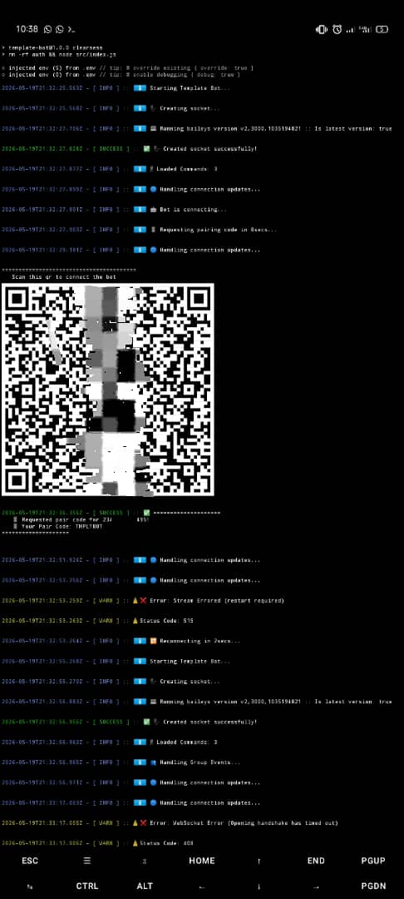
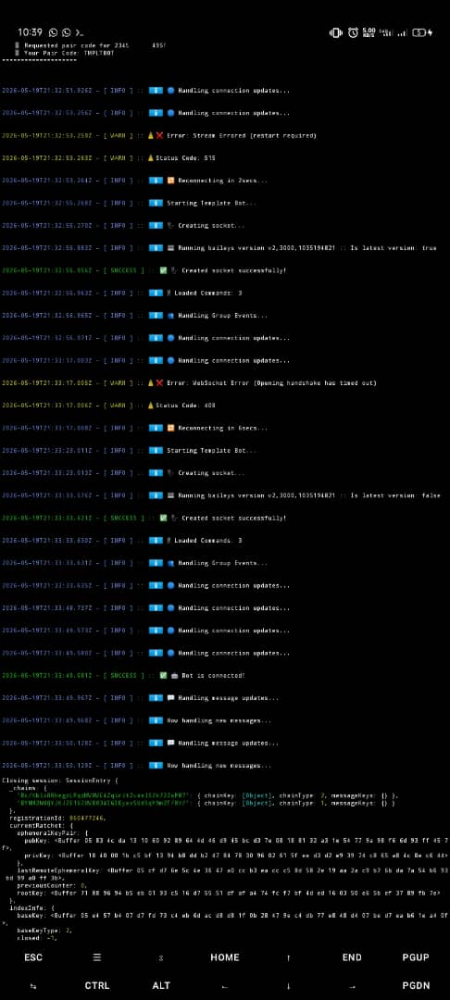

# Template Bot


<p>Welcome to Template Bot `beginner` branch.</p>
<p>A clean, modular WhatsApp bot starter template built to teach proper bot architecture, scalable code structure, and beginner-friendly development.</p>
<p>No spaghetti code. No 5,000-line index.js files. No copy-paste chaos. Just readable, extendable, production-style bot development.</p>
<p>Built for developers who want to understand, not just copy-paste.</p>

## Why This Exists
Most WhatsApp bot repositories on GitHub look like this:
```js
if (command === "ping") {
   // 400 lines later...
}
```
or **worse**:
```js
// index.js
// 7,000+ lines of pain and suffering
```
That teaches beginners the wrong way to build software.
This project exists to show:
- How bots should be structured.
- Clean code.
- Modular architecture.
- Scalable systems.
- Maintainable projects.
- Not spaghetti.

The project evolves across multiple branches:
- beginner → foundational architecture
- advanced → production systems
- senior → framework-level features

## Table of Contents
- [Quick Start](#quick-start)
    - [Requirements](#requirements)
    - [Installation](#installation)
        - [Clone The Repo](#clone-the-repo)
        - [Install Dependencies](#install-all-dependencies)
        - [Start The Bot](#start-the-bot)
- [Screenshots](#screenshots)
- [Features](#features)
    - [Main](#main)
    - [Commands](#commands)
    - [Extra Utilities](#extra)
- [Project Structure](#project-structure)
- [Philosophy](#philosophy)
- [Feature Plans](#template-bot-feature-plans)
- [License](#license)

## Quick Start
### Requirements
**NOTE**: Template Bot is actively developed on `Termux`, `Nodejs`, `Baileys` (formerly `@whiskeysockets/baileys`)...
#### PC
- Node.js v20+
- npm
- WhatsApp account
#### Termux
- An Android device (Smartphone / Tablet)
- Node.js v20+
- npm
- Whatsapp account
### Installation
#### Clone The Repo 
```bash
git clone https://github.com/darkid15/template-bot.git
```
#### Install All Dependencies
```bash
cd Template-Bot
npm install
```
#### Environment Variables
Rename the `.env.example` or create a new `.env` file, then configure your bot details.
```env
BOT_PREFIX=!
BOT_NAME="Template Bot"
BOT_PHONE=23480xxxxxxxxx37
MASTER_PHONE=4467xxxxxxxxx85
```
#### Start the bot 
```bash
npm start
```
**All together**:
```bash
git clone https://github.com/darkid15/template-bot.git
cd Template-Bot
npm install
npm start
```
### Logging in
Template Bot uses pair code login as default and QR as a fallback on fail. Feel free to change this in the [connection handler](./src/socket/events/connection.js) module.
1. Enter pair code/ scan QR.
2. Open Whatsapp
3. Send `!menu`


### Creating Commands

All commands live inside:
```txt
src/commands/
```
Example:
```js
import sendReply from '../utils/message/sendReply.js';

export default {
    name: "hello",
    category: "fun",
    desc: "Say hello",

    execute: async ({ sock, m }) => {
        await sendReply(sock, m, "Hello World!");
    }
}
```
And you're done!

## Screenshots
### Startup
<details>
    <summary>View</summary>
    <p align="center">
      
    </p>
    <p align="center">
      
    </p>
</details>

### Connection and Menu
<details>
    <summary>View</summary>
    <p align="center">
      
    </p>
</details>

## Features
### Main 
- Event-based architecture (current)
- Clean folder structure (current)
- Beginner-friendly code comments (current)
- Scalable project design (current)
- Event auto-loader (current)
### Commands 
- Modular command handler (current)
- Command auto-loader (current)
- Easy command creation (current)
- Group feature support (current)
### Extra 
- Cooldown system (planned)
- Permissions system (planned)
- Logging system (current)
- Production-style development workflow (current)


## Project Structure
```
template-bot/
 |_ src/
 |   |
 |   |__ commands/
 |   |
 |   |__ configs/
 |   |
 |   |__ handlers/
 |   |
 |   |__ socket/
 |   |
 |   |__ utils/
 |   |
 |   |__ index.js
 |
 |_ package.json
 |
 |_ .env
 |
 |_ README.md
 |
 |_ .gitignore
```

## Philosophy
This repo is **NOT** for copy-paste merchants.
It is for developers who want to learn:
- why code is structured this way
- how real projects scale
- how to add features without breaking everything
- how maintainable bots are actually built

If you want **instant bot glory** with *zero understanding*—
***this is not your repo***.

### Beginner Rule
1. Every file should teach, not just work.
2. Every important function is explained.
3. Every module exists for a reason.
4. This project is designed to help beginners understand architecture, not just run commands.

Because understanding > copying. **Always**.
#### Example
Instead of this:
```js
if (command === "ping") {
   reply("pong");
};
```
we do this:
```js
const command = commands.get(cmd);
if (command) command.execute();
```
Because scalable code matters. 

## Template Bot Feature Plans
| Feature | Status | Branch |
| --- | --- | --- |
| Command Handler | ✓ | beginner |
| Event Loader | ✓ | beginner |
| Welcome / Goodbye System | ✓ | beginner |
| Auth System | ✓ | beginner |
| Dashboard | x | advanced |
| Anti-link System | x | advanced |
| Anti-spam System | x | advanced |
| Dashboard Support | x | advanced |
| Plugin Support | x | senior |
| Middleware System | x | senior |
| Full Database Integration | x | senior |

This is a foundation.
**Build on it**.


### Contributing?
Good architecture only.
No spaghetti PRs.
If your code adds 600 lines to one file, we fight.
Respectfully.

### Final Words
Stop building bots that collapse when one command breaks.
Build systems.
Build structure.
Build things that last.
That is what this project is for.

## License
MIT License. More info in the [LICENSE](./LICENSE) file.

Use it.

Learn from it.

Improve it.

Teach others.

And please—

stop uploading *8,000-line index.js* files to GitHub.

> If this repo helped you, then give it a star ⭐!